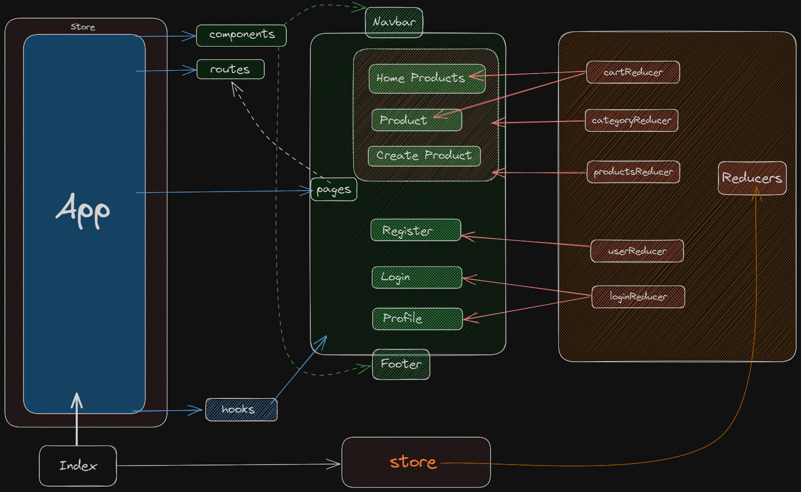

# Front-end Project

This project is an assignment for Integrify Academy to practice all the subjects in the Frontend block. This e-commerce app uses an external API to fetch the data.

## Project link

[https://guileless-trifle-3116f5.netlify.app](https://guileless-trifle-3116f5.netlify.app)

## API enpoints

[comm2024](https://comm2024.azurewebsites.net).

## Workflow:

## Application features:

## Requirements

✅ Create at lease 4 pages (can be more if you want): Page for

- ✅ all products,
- ✅ product page,
- ✅ profile page (only available if user logins), and
- ✅ cart page (cart page could be a page or a modal)

3. Create Redux store for following features:

   - product reducer:

     - ✅ get all products,
     - ✅ find a single products,
     - ✅ filter products by categories,
     - ✅ sort products by price.
     - ✅ Create, ✅update and ✅delete a product (✅enable update & delete features only for admin of the webapp)

   - ✅ user reducer: register and login
   - ✅ cart reducer: ✅add product to cart, ✅remove products, ✅update products's quantity in cart

4. ✅ When adding routers to your application, programatically set certain routes to be private. For example, route to user profile page should not be accessible if user has not logged in.
5. ✅ Implement unit testing for the reducers
6. ✅ Deploy the application and rewrite README file.

## Bonus

1. Use context API to switch theme
2. Use pagination when fetching/displaying all the products
3. Implement performance optimization where applicable

## Instruction to start the project

In the project directory, you can run:

### `npm install`

Install all the dependencies

### `npm start`

Runs the app in the development mode.\
Open [http://localhost:3000](http://localhost:3000) to view it in the browser.

The page will reload if you make edits.\
You will also see any lint errors in the console.

### `npm test`

Launches the test runner in the interactive watch mode

### `npm run build`

Builds the app for production to the `build` folder.\
It correctly bundles React in production mode and optimizes the build for the best performance.
